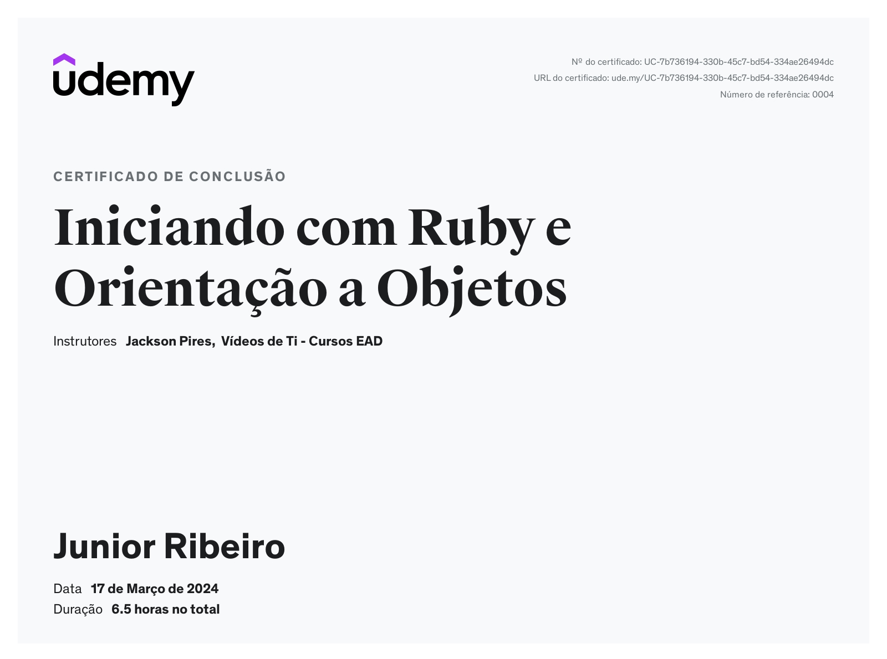

# Ruby Course

This repository contains all the projects and materials from the Ruby course.

## Certificate

## Course Summary

The course aims to introduce students to the fundamentals of Ruby and Object-Oriented Programming. It is divided into 3 main modules that will facilitate explanation and learning for the students. By the end of the course, it is intended that the student will have a solid understanding of Ruby basics and Object-Oriented principles applied to the language.

## Projects

- **Hangman Project**: A hangman game developed in Ruby.

## Lessons

- Lesson 1: Introduction to Ruby
- Lesson 2: Object-Oriented Programming in Ruby
- Lesson 3: Advanced Topics in Ruby

Each folder in this repository corresponds to a lesson of the course.

